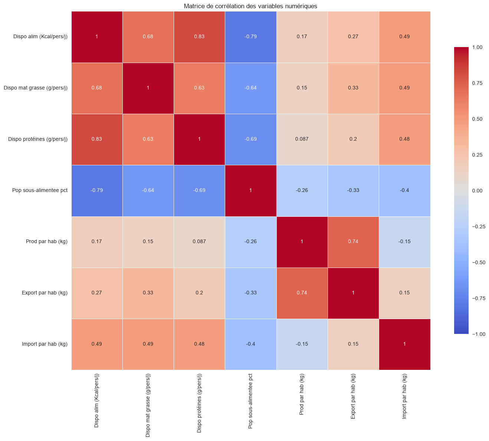
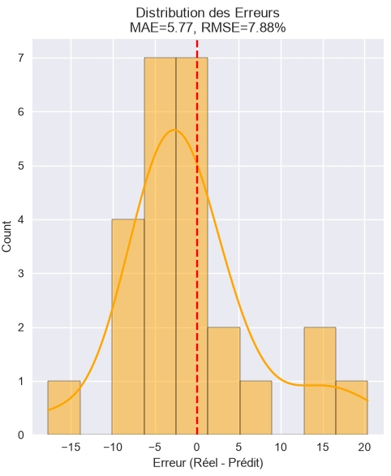
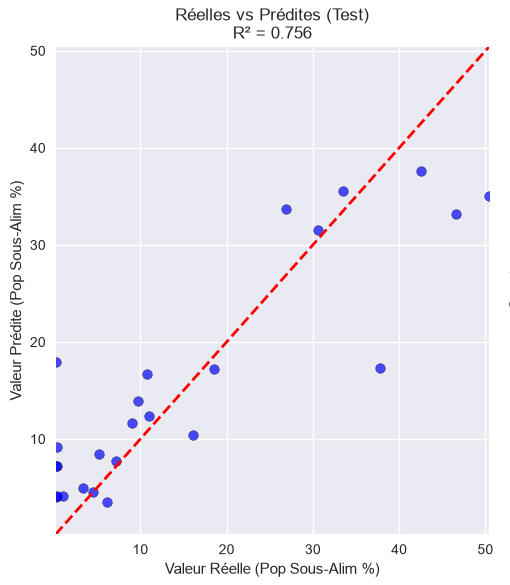
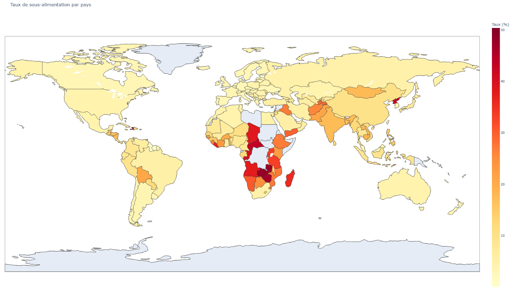

# Analyse et Prédiction de la Sous-Alimentation Mondiale

<!-- Le Logo FAO (assure-toi qu'il est dans le dossier public/ de ton projet) -->

### Transformer des données fragmentées en une vision globale
  
  

**Présenté par Johan**  
*Data Analyst Trainee*

---
layout: default
---

# 🎯 L'Objectif du Projet

**Le Problème :**
L'accès à l'information alimentaire est fragmenté. Les données sur la sous-alimentation sont incomplètes, créant des "zones d'ombre" géographiques (pays sans données déclarées).

**La Mission :**
1. **Nettoyer** des sources de données hétérogènes.
2. **Modéliser** les relations entre ressources (calories/protéines) et sous-alimentation.
3. **Prédire** les taux manquants pour obtenir une cartographie mondiale sans interruption.

---
layout: default
---

# 🛠️ Étape 1 : Le Défi des Données

### L'état initial (Data Audit)

* Sources multiples (CSV).
* Colontynes mal typées (`object` vs `float`).
* Valeurs incohécompressibles (`<0.1`).
* Absence de continuité géographique.

#### 📊 Résumé du Diagnostic

| Indicateur | Statut | Action |
| :--- | :---: | :--- |
| Complétude | ⚠️ ALERTE | Nettoyage des colonnes vides |
| Cohérence | ❌ ERREUR | Conversion des types (String $\rightarrow$ Float) |
| Géographie | ⚠️ ALERTE | Filtrage des zones communes |

---

# ⚙️ Étape 2 : La Transformation

### Du "Poids Global" à l' "Indicateur par habitant"

Pour rendre les pays comparables, j'ai réinventé la donnée :

*   **Standardisation :** Harmonisation des noms de zones (FAO $\rightarrow$ ISO3).
*   **Feature Engineering :** 
    *   $\text{Production} \rightarrow \text{Production par habitant}$
    *   $\text{Import/Export} \rightarrow \text{Flux par habitant}$
*   **Imputation Intelligente :** Remplacement des valeurs indéterminées (`<0.1`) par une valeur métier (0.001) pour préserver la structure statistique.

---
layout: two-cols
---

# 📊 Étape 3 : L'Analyse Statistique

### Identifier les leviers de nutrition

L'analyse des corrélations permet d'isoler les variables qui impactent réellement le taux de sous-alimentation.

::right::

<!-- Affichage de la heatmap -->

  Matrice de Corrélation : Identification des variables clés

---

# 🤖 Étape 4 : Le Modèle Prédictif

### Algorithme : Random Forest Regressor

**Architecture du Pipeline :**
1. **Imputation :** Médiane pour les valeurs manquantes.
2. **Scaling :** Standardisation des données (StandardScaler).
3. **Régression :** Forêt aléatoire optimisée via `GridSearchCV`.

<!-- Colonne 1 : Erreurs -->

Évaluation de l'erreur (Distribution des résidus)

<!-- Colonne 2 : Performance -->

Performance : Réel vs Prédit

---
layout: default
---

# 🌍 Le Réassemblage Final

<!-- On utilise l'élément HTML img standard avec un chemin direct -->

  Cartographie complète intégrant les données réelles et les prédictions

---
layout: default
---

# 🚀 Conclusion & Perspectives

**Ce que j'ai accompli :**
* ✅ Un pipeline automatisé de nettoyage à la prédiction.
* ✅ Une unification des données mondiales par habitant.
* ✅ Une estimation fiable des zones auparavant inaccessibles.

**Pour aller plus loin :**
* 📈 **Données Macro :** Intégrer le PIB et l'indice de développement humain (IDH).
* ⚠️ **Contexte Géopolitique :** Modéliser l'impact des conflits et des crises sanitaires sur la disponibilité alimentaire.
* ⚖️ **Précision Statistique :** Affiner l'imputation des valeurs '<0.1' pour qu'elle soit proportionnelle à la taille de la population (éviter les biais sur les petits États).

---
layout: center
class: text-center
---

# Merci de votre attention !
## Des questions ?